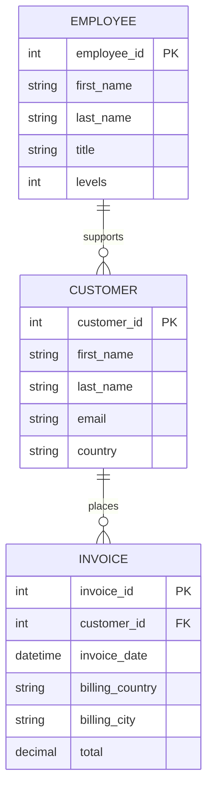

# Database Architecture and ER Diagram

## Overview
The queries in this repository interact with a relational database structured around music sales. The core tables include entities for employees, customers, and their respective invoices.

## Entity Relationship (ER) Diagram
Below is the ER diagram representing the core schema utilized in the analysis. This schema assumes relational mappings based on the explicit `JOIN` logic in our queries.

## Architecture Explanation
1. **`EMPLOYEE` Table:** Tracks the internal hierarchy and staff metadata. Used for understanding internal seniority (e.g., job levels).
2. **`CUSTOMER` Table:** Stores demographic and contact information for buyers. Connects to `INVOICE` to analyze individual customer spending behavior.
3. **`INVOICE` Table:** Acts as the central fact table containing transaction totals and geographic metadata (billing country/city). Joined with `CUSTOMER` to generate aggregations for top-spending individuals and regions.

This normalized structure ensures data integrity and avoids duplication, while enabling robust analytical queries through `JOIN` and aggregation logic.
